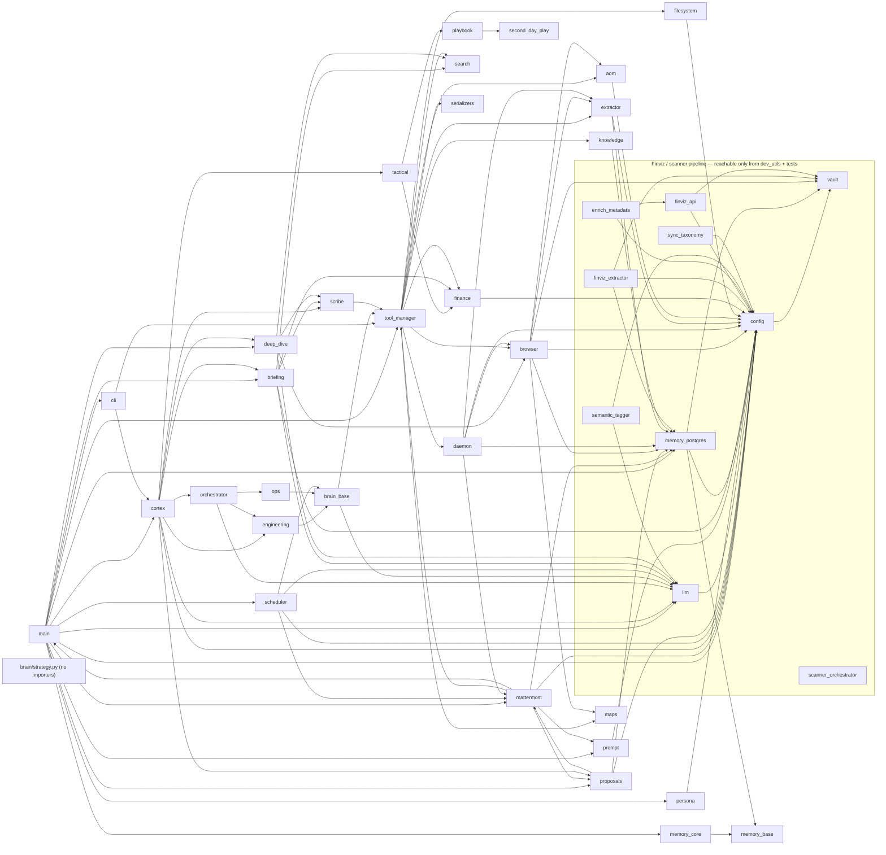

# Cobalt Assessment — Pass 0: Repository Inventory

Date: 2026-08-21 · Baseline: commit `6ec3d33` (tag `pre-assessment`, 34 commits on `main`, working tree clean) · Assessor: Claude Fable 5 (read-only)

Scope of this pass: inventory only. No RETAIN / BROKEN-FRICTION / KILL judgments yet — those start in Pass 1. Where a fact was inferred rather than read/run it is marked **UNVERIFIED**.

---

## 1. Method and scope

**Done**
- Read `CLAUDE.md` and `COBALT-REQUIREMENTS.md` in full.
- Regenerated context with `dev_utils/generate_context.py`, **scoped per directory** (see finding F-2): `-d src -o cobalt_context.txt` (483 KB, 47 files, gitignored root dump) plus `-d tests`, `-d dev_utils`, `-d configs`, `-d ops` into the session scratchpad (not the repo).
- Inventoried the tracked tree via `git ls-files` + `wc -l`; built the dependency graph with a deterministic `ast` walker over every tracked `.py`; grepped for entry points, gitignored-path references, hardcoded paths, and fundamentals/filings/earnings/news touchpoints; ran `pytest --collect-only` (collect only; `conftest.py` mocks `psycopg.connect`).
- Root files read directly: `cobalt.sh`, `pyproject.toml`, `docker-compose.yml`, `orchestration_plan.json`, `.clinerules`, `.vscode/extensions.json`, `ops/*`, `configs/*`, `src/cobalt_agent/db/schema.sql`, `src/cobalt_agent.egg-info/SOURCES.txt`.

**Deliberately NOT read** (gitignored by design — only top-level names observed where `ls` of the repo root exposed them)
- `data/` (Postgres bind mount `./data/postgres`, encrypted vault blob `data/.cobalt_vault`, legacy `data/memory.json`)
- `docs/` vault folders other than `docs/assessment/` — i.e. `docs/0 - Inbox/`, `docs/0 - Projects/` (names only; see F-1)
- `.env` (`.env.example` is tracked but 0 bytes), `logs/`, `.venv/`, `venv/`, `.pytest_cache/`

**Runtime facts observed**: `uv` 0.10.2; `.venv` Python **3.14.3** (`pyproject` says `>=3.11`); `cobalt.sh start` runs `uv run src/cobalt_agent/main.py` after pre-flight checks on LM Studio :1234, Postgres :5432, Mattermost :8065.

---

## 2. Directory tree (tracked files; ignored dirs shown as placeholders)

```
cobalt/
├── .clinerules                      # Cline/local-LLM operating rules (34)
├── .env.example                     # EMPTY (0 bytes)
├── .gitignore
├── .vscode/extensions.json          # recommends saoudrizwan.claude-dev
├── CLAUDE.md                        # standing instructions (122)
├── COBALT-REQUIREMENTS.md           # single source of truth (385)
├── README.md                        # EMPTY (0 bytes)
├── cobalt.sh                        # start/stop/status/restart (105)
├── docker-compose.yml               # db (pgvector/pg16), pgadmin, mattermost (56)
├── orchestration_plan.json          # {"task":"default_task","status":"pending"} (3)
├── pyproject.toml                   # cobalt-agent 0.1.0 (82)
├── uv.lock                          # (5696)
├── configs/
│   ├── config.yaml                  # system, network nodes, model registry, active_profile, mattermost, persona, departments, browser whitelist (140)
│   ├── prompts.yaml                 # keys: system, scheduler, ops, engineering, proposal, routing, orchestrator, research (226)
│   ├── rules.yaml                   # trading_rules (momentum/MA/RSI/ATR) + cortex_routing keywords (27)
│   ├── scanners.yaml                # 4 Finviz screeners w/ schedules (54)
│   └── strategies.yaml              # second_day_play (active), fashionably_late_scalp, second_chance_scalp (inactive) (82)
├── dev_utils/                       # 18 files, 2 580 lines — see §3.3
├── ops/
│   ├── com.cobalt.agent.plist       # LaunchAgent → /Users/cobalt/cobalt/cobalt.sh start (28)
│   ├── com.cobalt.mainframe.plist   # LaunchAgent → ~/.lmstudio/start_mainframe.sh (18)
│   └── start_mainframe.sh           # lms load qwen3.5-122b-a10b as "mainframe" + caffeinate ping loop (48)
├── src/
│   ├── cobalt_agent.egg-info/       # TRACKED build artefact (5 files, 158 lines) — see F-7
│   └── cobalt_agent/
│       ├── __init__.py (0)  config.py (631)  llm.py (333)  main.py (222)  persona.py (142)  prompt.py (155)
│       ├── brain/      base.py cortex.py engineering.py ops.py playbook.py strategy.py tactical.py strategies/{__init__,second_day_play}.py
│       ├── core/       __init__.py orchestrator.py proposals.py
│       ├── db/         schema.sql (229)
│       ├── interfaces/ __init__.py cli.py mattermost.py
│       ├── memory/     __init__.py base.py core.py postgres.py
│       ├── security/   __init__.py vault.py
│       ├── services/   __init__.py scheduler.py
│       ├── skills/
│       │   ├── productivity/ briefing.py scribe.py
│       │   └── research/     deep_dive.py enrich_metadata.py finviz_api.py finviz_extractor.py scanner_orchestrator.py semantic_tagger.py sync_taxonomy.py
│       ├── tools/      __init__.py aom.py browser.py daemon.py extractor.py filesystem.py finance.py knowledge.py maps.py search.py tool_manager.py
│       └── utils/      __init__.py serializers.py
├── tests/                           # conftest.py + 18 test modules, 4 724 lines — see §3.4
│
├── data/        [gitignored — Postgres bind mount + vault blob; NOT inventoried]
├── docs/        [gitignored vault root = configs obsidian_vault_path; NOT inventoried except docs/assessment/]
│   ├── 0 - Inbox/       [name only]
│   ├── 0 - Projects/    [name only]
│   └── assessment/      ← this file (only un-ignored path under docs/)
├── logs/        [gitignored — loguru daily files, cobalt.pid, mattermost_session.log; NOT inventoried]
├── .venv/ venv/ .pytest_cache/   [gitignored]
```

Note: `src/cobalt_agent/skills/` has **no `__init__.py`** at `skills/`, `skills/productivity/`, `skills/research/` (namespace packages) and `brain/` has none either; `db/` holds only SQL.

---

## 3. File inventory with line counts

Totals (tracked, excluding `uv.lock` 5 696): **20 503 lines / 114 files**; 88 `.py` files.

| Area | Files | Lines |
|---|---:|---:|
| `src/cobalt_agent/` (.py + schema.sql) | 52 | 11 611 |
| `src/cobalt_agent.egg-info/` | 5 | 158 |
| `tests/` | 19 | 4 724 |
| `dev_utils/` | 18 | 2 580 |
| `configs/` | 5 | 529 |
| `ops/` | 3 | 94 |
| root files (`.clinerules`, `.env.example`, `.gitignore`, `.vscode/extensions.json`, `CLAUDE.md`, `COBALT-REQUIREMENTS.md`, `cobalt.sh`, `docker-compose.yml`, `orchestration_plan.json`, `pyproject.toml`, `README.md`) | 11 | 807 |
| `uv.lock` | 1 | 5 696 |

### 3.1 `src/cobalt_agent/` — package root and sub-packages

| File | Lines | Purpose (module docstring / top-level symbols) |
|---|---:|---|
| `__init__.py` | 0 | — |
| `config.py` | 631 | "Configuration Management" — Pydantic models (`SystemConfig`, `LLMConfig`, `PersonaConfig`, `NetworkConfig`, `PostgresConfig`, `MattermostConfig`, `BrowserConfig`, strategy/trading-rule models…), `get_config()`, loads `.env` + `configs/*.yaml`, unlocks VaultManager from `COBALT_MASTER_KEY` (`config.py:557`) |
| `llm.py` | 333 | "LLM (The Brain)" — `class LLM`: role → `active_profile` alias → model registry → LiteLLM `completion()`; local `api_base` from network node (`llm.py:46-81`) |
| `main.py` | 222 | "Main Entry Point" — `class CobaltAgent`; `__main__` starts `CobaltScheduler` then `start_mattermost_interface()` (Mattermost WS + `ProposalEngine`); `.main()` = CLI mode (not invoked by `__main__`) |
| `persona.py` | 142 | `class Persona`, `PersonaConfig` |
| `prompt.py` | 155 | `class PromptEngine` — builds system prompt incl. tool list; embeds `data/`, `logs/` layout text (`prompt.py:82-83`) |
| **brain/** | | |
| `brain/base.py` | 109 | "Unified ReAct Execution Engine" — `class BaseDepartment` |
| `brain/cortex.py` | 250 | "The Cortex (Manager Agent)" — `DomainDecision`, `class Cortex`: routes to TACTICAL/INTEL/GROWTH/OPS/ENGINEERING/DEFAULT (`cortex.py:92-109`), `_generate_proposal` |
| `brain/engineering.py` | 42 | "The Forge" — `EngineeringDepartment(BaseDepartment)` |
| `brain/ops.py` | 41 | "The Scribe (Ops Department)" — `OpsDepartment`; prompt hardcodes `0 - Inbox/` examples (`ops.py:25-39`) |
| `brain/playbook.py` | 113 | "Playbook Registry" — `class Playbook`, loads `configs/strategies.yaml` (`playbook.py:20`) |
| `brain/strategy.py` | 49 | "Strategy Interface (The Contract)" — `class Strategy` (**0 importers**) |
| `brain/tactical.py` | 60 | "Strategos Agent (Tactical Dept Head)" — `class Strategos` |
| `brain/strategies/__init__.py` | 0 | — |
| `brain/strategies/second_day_play.py` | 104 | "Second Day Play — Strategy Logic" — `class SecondDayPlay` |
| **core/** | | |
| `core/__init__.py` | 6 | re-exports |
| `core/orchestrator.py` | 156 | "Orchestration State Machine" — `SubTask`, `OrchestrationState`, `OrchestratorEngine`; prompt text hardcodes `data/`, `docs/` (`orchestrator.py:114-115`) |
| `core/proposals.py` | 652 | "HITL Proposal Engine" — `HITLProposalStore`, `IntentAlignment`, `Proposal`, `ProposalEngine`, `create_proposal_and_send_to_mattermost()` |
| **db/** | | |
| `db/schema.sql` | 229 | 5-Pillar DDL: `instruments, themes, key_levels, daily_in_play, market_snapshots, news_events, news_mentions, system_alerts, strategy_signals, trading_accounts, hitl_proposals, trades, order_fills` + indexes; extensions `uuid-ossp`, `vector`. Applied only by `dev_utils/init_5_pillar_schema.py`; read by `dev_utils/db_status.py` |
| **interfaces/** | | |
| `interfaces/__init__.py` | 7 | re-exports |
| `interfaces/cli.py` | 237 | "Interactive CLI Interface" — `class CLI` (Rich) |
| `interfaces/mattermost.py` | 854 | "Mattermost Communication Interface" — `class MattermostInterface`: `mattermostdriver` + native `websockets`; `approve/reject` token handling (`mattermost.py:383`); `ACTION:` tool parsing; imports `cobalt_agent.main` (circular w/ `main.py`) |
| **memory/** | | |
| `memory/__init__.py` | 7 | exports `MemorySystem` |
| `memory/base.py` | 29 | `MemoryProvider` interface |
| `memory/core.py` | 97 | JSON fallback `MemorySystem` → `data/memory.json` (`core.py:22`) |
| `memory/postgres.py` | 1 167 | "Postgres Memory Adapter (Hippocampus)" — `compute_context_signature`, `compute_task_hash`, `extract_visible_text`, `class FastPathCache` (table `browser_fast_path`, `postgres.py:177`), `class PostgresMemory` (table `memory_logs` 1536-dim, `graph_nodes`, `graph_edges`, `hitl_proposals` created at `postgres.py:621-737`); `_scrub_secrets`; methods `store_hilt_proposal` / `get_hilt_proposal` / `update_hilt_proposal_status` (`postgres.py:1036,1063,1094`) against table `hitl_proposals` — the known `_hilt_`/`hitl_` naming inconsistency, confirmed |
| **security/** | | |
| `security/__init__.py` | 0 | — |
| `security/vault.py` | 105 | "Local Vault Manager (JIT Secrets)" — `class VaultManager`, default path `data/.cobalt_vault` (`vault.py:19`), `cryptography` |
| **services/** | | |
| `services/__init__.py` | 6 | re-exports |
| `services/scheduler.py` | 231 | "Cobalt Scheduler Service" — `CobaltScheduler` (APScheduler `BackgroundScheduler`, ONE job: `morning_briefing` cron Mon-Fri 08:00, `scheduler.py:29-37`), `BriefingAgent(BaseDepartment)` writes `Morning_Briefing_<date>.md` into vault (`scheduler.py:90-91`) |
| **skills/productivity/** | | |
| `skills/productivity/briefing.py` | 115 | "Morning Briefing Skill" — `BriefingReport`, `MorningBriefing` (finance + search tools → scribe) |
| `skills/productivity/scribe.py` | 202 | "Scribe Skill (Obsidian)" — `class Scribe`; fallback vault `~/Documents/Think` (`scribe.py:38-39`); writes `<folder>/<file>.md`, `Daily_Log_<date>.md`; `rglob("*.md")` |
| **skills/research/** | | |
| `skills/research/deep_dive.py` | 109 | "Deep Research Agent" — `ResearchPlan`, `ResearchReport`, `DeepResearch` (browser + search + scribe) |
| `skills/research/enrich_metadata.py` | 163 | "Metadata Enrichment (Finviz API Bridge)" — `MetadataEnricher`, own `psycopg2` connection, fields incl. `Shares Float`, `Short Float` (`:125-126`); `__main__`; **0 importers** |
| `skills/research/finviz_api.py` | 435 | "Finviz API Client (Macro Engine)" — `FinvizApiClient` (httpx → `elite.finviz.com` CSV export; screener / quote / **news** endpoints `:352-362`); vault key `finviz.com::api_token` |
| `skills/research/finviz_extractor.py` | 752 | "Finviz Recon Scout" — `FinvizExtractor` (Playwright login to Finviz Elite, screener preset URLs `:199-201`, writes `logs/debug_table.png` `:228`, FastPath integration `:566`); `extract_finviz_screener()` |
| `skills/research/scanner_orchestrator.py` | 115 | `ScannerOrchestrator` — Finviz screener rows → 5-Pillar DB (`psycopg2`, `yaml`); no module docstring |
| `skills/research/semantic_tagger.py` | 329 | "Semantic Tagging Drip Engine" — LLM theme assignment into `themes`/`instruments`; `__main__` |
| `skills/research/sync_taxonomy.py` | 138 | "Master Taxonomy Sync" — parses vault note `0 - Projects/Cobalt/00 - Master Plan/Master_Taxonomy.md` (`:119`) → `themes`; `__main__`; **0 importers** |
| **tools/** | | |
| `tools/__init__.py` | 1 | — |
| `tools/aom.py` | 491 | "AOM (Accessibility Object Model) Extractor" — `AOMExtractor`, `extract_aom`, `is_url_allowed` (domain whitelist from `config.yaml browser.allowed_domains`) |
| `tools/browser.py` | 771 | "Browser Tool with Playwright" — `BrowserCommand` + action schemas (`Click/Type/Maps/Extract/InjectCredentials`), `BrowserTool` (vault credential injection, FastPathCache) |
| `tools/daemon.py` | 264 | "Watcher Daemon" — `DaemonTool` (APScheduler interval watchers), `_run_watcher_job`, `_send_watcher_alert` (Mattermost) |
| `tools/extractor.py` | 336 | "Universal Extractor — Graph Data Parser" — `GraphNode/GraphEdge/DeltaResult`, `UniversalExtractor` (LiteLLM), `compute_delta` |
| `tools/filesystem.py` | 365 | "Filesystem Tools" — Read/Write/Append/ListDirectory tools jailed to `config.system.obsidian_vault_path` (`filesystem.py:89`) |
| `tools/finance.py` | 262 | "Finance Tool" — `MarketMetrics`, `FinanceTool` (**yfinance**: price, RSI/ATR/RVOL, AVWAP from last **earnings** date `:127-134,177-181`) |
| `tools/knowledge.py` | 65 | `KnowledgeSearchTool` → `PostgresMemory.search` |
| `tools/maps.py` | 268 | "AOM Maps — Stateful Element Handle Mapping" |
| `tools/search.py` | 59 | "Search Tool" — `SearchTool` (DuckDuckGo via `ddgs`; "news, information…") |
| `tools/tool_manager.py` | 268 | "Tool Manager" — registers `search, browser, finance, read_file, write_file, append_to_file, list_directory, search_knowledge, daemon, aom, maps, extractor` (`tool_manager.py:67-100`); `execute_tool(..., bypass_hitl)` |
| **utils/** | | |
| `utils/__init__.py` | 7 | re-exports |
| `utils/serializers.py` | 62 | `CobaltJSONEncoder`, `serialize_to_json` |

### 3.2 `src/cobalt_agent.egg-info/` (tracked)

`PKG-INFO` 45 · `SOURCES.txt` 73 · `requires.txt` 38 · `dependency_links.txt` 1 · `top_level.txt` 1. `SOURCES.txt` lists the current module set except `skills/research/enrich_metadata.py` and `sync_taxonomy.py` → stale artefact (see F-7).

### 3.3 `dev_utils/` (2 580 lines)

| File | Lines | `__main__` | Purpose / notes |
|---|---:|:-:|---|
| `__init__.py` | 0 | | |
| `check_gemini_models.py` | 22 | | **Not valid Python** — file begins with a shell line `uv run python -c "` (SyntaxError at line 1) |
| `create_missing_tasks.py` | 181 | | Writes task notes into vault `0 - Projects/Cobalt/Tasks` via scribe loaded with `importlib` (`:22`) — runs at import (no `__main__` guard) |
| `create_prd.py` | 117 | | Writes `0 - Projects/Cobalt/90 - Project Management/Requirements/PRD-001 … .md` via importlib-loaded scribe — runs at import |
| `db_status.py` | 333 | ✓ | Rich audit of DB tables parsed from `schema.sql` (`:301`) |
| `generate_constitution.py` | 319 | | Writes Master Plan / ADR-001..003 / Roadmap / Backlog notes under `0 - Projects/Cobalt/…` — runs at import |
| `generate_context.py` | 140 | ✓ | Context dump generator (see F-2) |
| `ingest_knowledge.py` | 172 | ✓ | AST graph of `src/` + ingests ALL `docs/**/*.md` (the vault) into PostgresMemory (`:164`) |
| `init_5_pillar_schema.py` | 212 | ✓ | Applies `schema.sql` (psycopg2) |
| `lightspeed_formatter.py` | 48 | | `format_lightspeed_trades()` — pandas formatter for Lightspeed trade CSV columns (read-only data shaping; **flag**: touches a trading-platform export format) |
| `live_run_dynamic_scanners.py` | 104 | ✓ | Runs `configs/scanners.yaml` screeners via `FinvizApiClient` |
| `live_run_finviz.py` | 146 | ✓ | Live Finviz export call; vault `data/.cobalt_vault` |
| `live_run_finviz_quote.py` | 113 | ✓ | Finviz quote endpoint runner |
| `live_run_orchestrator.py` | 169 | ✓ | Full Finviz → `ScannerOrchestrator` → `SemanticTagger` pipeline stress test |
| `manage_vault.py` | 84 | ✓ | VaultManager CLI; prints `export COBALT_MASTER_KEY='…'` to console on key generation (`:25`) — **flag** vs INFRA-0 secret-handling policy |
| `test_5_pillar_db.py` | 308 | ✓ | DB integration test (not collected by pytest: `dev_utils` in `norecursedirs`) |
| `test_routing.py` | 44 | ✓ | LLM routing smoke; imports `src.…` |
| `update_board.py` | 68 | ✓ | Obsidian project-board task creation via `Scribe` |

Not present anywhere in the tree (CLAUDE.md names them): `dev_utils/wipe_memory.py`, `dev_utils/reset_memory_table.py` (see F-4).

### 3.4 `tests/` (4 724 lines; `pytest --collect-only`: **149 tests collected, 1 collection error**)

| File | Lines | Subject | Notes |
|---|---:|---|---|
| `conftest.py` | 90 | `load_dotenv()`, autouse mock of `cobalt_agent.memory.postgres.psycopg.connect`, `temp_vault_path`, `mock_config` | reads `.env` at collection |
| `test_browser_actions.py` | 321 | Browser action schemas, vault credential injection | imports `src.cobalt_agent…` |
| `test_browser_aom.py` | 605 | AOM extractor, domain whitelist | imports `src.…` |
| `test_browser_fast_path.py` | 309 | FastPathCache | imports `src.…` |
| `test_cortex.py` | 300 | Cortex routing | |
| `test_daemon.py` | 222 | Watcher job / alert | |
| `test_finviz_extractor.py` | 482 | Finviz extractor integration | **ImportError at collection**: imports `FinvizStockData` which no longer exists in `finviz_extractor.py` |
| `test_llm.py` | 254 | LLM role routing | |
| `test_mock_debug.py` | 128 | Mock DB wiring | |
| `test_orchestrator.py` | 373 | OrchestratorEngine | |
| `test_postgres_graph.py` | 573 | graph_nodes/edges | |
| `test_postgres_memory.py` | 177 | Secret scrubber | |
| `test_proposals_intent.py` | 94 | Proposal intent alignment | |
| `test_scheduler.py` | 173 | Scheduler (vault path mocked `/test/vault`) | |
| `test_scribe.py` | 34 | Scribe | |
| `test_strategies.py` | 75 | SecondDayPlay | |
| `test_universal_extractor.py` | 290 | UniversalExtractor | |
| `test_vault.py` | 191 | VaultManager | |
| `test_vision.py` | 33 | cv2/mss screenshot helpers — no pytest assertions, no `cobalt_agent` import | |

Mixed import styles: 13 test modules import `cobalt_agent.*` (package installed/`src` layout); 3 import `src.cobalt_agent.*` (relies on `conftest.py` `sys.path` insert of repo root). Both resolve today; two copies of each module can load under different names (**UNVERIFIED** whether this double-loads `PostgresMemory` and defeats the autouse mock for those 3 files).

---

## 4. Entry points and runtime surfaces

| Surface | Location | What it does |
|---|---|---|
| **LaunchAgent → process** | `ops/com.cobalt.agent.plist` → `cobalt.sh start` | RunAtLoad; WorkingDirectory `/Users/cobalt/cobalt`; stdout/err to `~/cobalt_agent_boot.{log,err}` |
| **Process manager** | `cobalt.sh {start,stop,status,restart}` | sources `~/.cobalt_key` (exports master key), waits for :1234/:5432/:8065 (120 s), `nohup uv run src/cobalt_agent/main.py > logs/mattermost_session.log`, PID in `logs/cobalt.pid`; stop = SIGTERM |
| **Main** | `src/cobalt_agent/main.py:209-222` | `CobaltAgent()` → `CobaltScheduler.start()` → `start_mattermost_interface()` (blocking WS loop). Note `CobaltAgent.main()` (CLI mode, `main.py:83`) is **not** reachable from `__main__`; a second `CobaltScheduler` would be created if it were |
| **Mattermost** | `interfaces/mattermost.py` | WS listener; DM → `Cortex.route` → LLM/tool `ACTION:`; `approve <token>` / `reject <token>` → `ProposalEngine` (`:383`); approval channel `cobalt-approvals` / team `cobalt-bridge` (`configs/config.yaml:82-84`) |
| **Scheduler** | `services/scheduler.py:29` | single cron job `morning_briefing` Mon–Fri 08:00 → Gemini 3.1 Pro preview (role `researcher`) → vault note |
| **Watcher daemon** | `tools/daemon.py` | ad-hoc interval jobs created by the `daemon` tool at runtime (URL watchers → Mattermost alerts) |
| **CLI** | `interfaces/cli.py` via `CobaltAgent.main()` | interactive Rich loop — currently dead path from `__main__` |
| **LLM routing** | `llm.py:46-81` + `configs/config.yaml:37-80` | roles `default/coder/architect/strategist/fast_chat` → `mainframe` (LM Studio, node `cortex` localhost:1234); `researcher` → `cloud_gemini_3_1_pro_preview`; registry also lists `gpt-5.2`, `anthropic/claude-4.6-opus|sonnet` via OpenRouter, `gemini-2.5-pro|flash` |
| **Local model service** | `ops/com.cobalt.mainframe.plist` → `ops/start_mainframe.sh` | `lms load qwen3.5-122b-a10b --identifier mainframe --context-length 32768` + caffeinate keep-alive ping every 60 s. **Still the 122B MoE** (INFRA-3 not yet applied); `config.yaml:44` declares context 65536 vs 32768 loaded |
| **Docker** | `docker-compose.yml` | `db` pgvector/pg16 :5432 (profile core, bind `./data/postgres`, restart always), `pgadmin` :18080, `mattermost` enterprise :8065 (profile core) |
| **DB schema bootstrap** | `dev_utils/init_5_pillar_schema.py` (schema.sql) + `PostgresMemory._init_db/_init_graph_tables/_init_hitl_tables` (runtime `CREATE TABLE IF NOT EXISTS`) | two independent DDL sources; both define `hitl_proposals` |
| **dev_utils runners** | 12 scripts with `__main__` (§3.3) + 3 scripts that execute on import | only path by which the Finviz/scanner pipeline runs today (see §5.3) |
| **Packaging** | `pyproject.toml` | no `[project.scripts]`; setuptools `where=["src"]`; pytest `testpaths=["tests"]`, `asyncio_mode=auto`, marker `integration` |

---

## 5. Dependency graph

### 5.1 Internal module graph (`src/cobalt_agent`, static imports only; no `importlib` wiring exists in `src/`)



Cycles observed: `main ↔ mattermost` (`mattermost.py` imports `cobalt_agent.main` for typing/brain reference), `mattermost ↔ proposals`, `scheduler → mattermost → main → scheduler`, `daemon → mattermost`, `browser ↔ extractor` (browser imports extractor; extractor does not import browser — one-way; listed for Pass 2 check). **UNVERIFIED** whether these are guarded (lazy/`TYPE_CHECKING`) — to be confirmed in the relevant passes.

### 5.2 Fan-in (who imports whom, `src` modules; counts include tests/dev_utils)

| Module | Importers | Module | Importers |
|---|---:|---|---:|
| `config` | 25 | `tools.browser` | 4 |
| `memory.postgres` | 12 | `tools.extractor` | 4 |
| `llm` | 10 | `brain.base` | 3 |
| `security.vault` | 10 | `brain.cortex` | 3 |
| `core.proposals` | 5 | `services.scheduler` | 3 |
| `interfaces.mattermost` | 5 | `tools.finance` | 3 |
| `skills.productivity.scribe` | 5 | `tools.search` | 3 |
| `skills.research.finviz_api` | 5 (4 dev_utils + enrich_metadata) | `tools.aom/daemon/maps` | 2 each |
| `tools.tool_manager` | 5 | `core.orchestrator`, `brain.engineering`, `brain.strategies.second_day_play`, `memory.base`, `prompt`, `skills.*.briefing`, `skills.*.deep_dive`, `utils.serializers` | 2 each |
| — | — | `brain.ops`, `brain.playbook`, `brain.tactical`, `interfaces.cli`, `main`, `memory`, `memory.core`, `persona`, `tools.filesystem`, `tools.knowledge`, `skills.research.finviz_extractor` (test only), `scanner_orchestrator` (dev_utils only), `semantic_tagger` (dev_utils only) | 1 each |
| **0 importers** | `brain/strategy.py`, `skills/research/enrich_metadata.py`, `skills/research/sync_taxonomy.py` | | |

### 5.3 Reachability from the production entry point (`main.py` `__main__`)

Reachable: config, llm, persona, prompt, cortex (+orchestrator, engineering, ops, base, tactical, playbook, second_day_play), scheduler, proposals, mattermost, cli (imported, not run), tool_manager (+all 10 tools), memory.postgres/core/base, vault, briefing, deep_dive, scribe, serializers.

**Not reachable from the running agent** (static analysis; no dynamic imports in `src/`): the entire Finviz/scanner/5-Pillar ingestion chain — `finviz_api`, `finviz_extractor`, `scanner_orchestrator`, `semantic_tagger`, `enrich_metadata`, `sync_taxonomy` — plus `brain/strategy.py`. They run only via `dev_utils/live_run_*.py` / `__main__` guards. `configs/scanners.yaml` schedules (04:00–10:00 every 2 min etc.) are therefore **not executed by any scheduler** today — only `dev_utils/live_run_dynamic_scanners.py` reads them. Likewise `configs/strategies.yaml` is read by `Playbook` (reachable via `tactical`), but `rules.yaml` trading thresholds are only loaded into `config` models (consumer to be established in Pass 4).

### 5.4 External dependencies — declared vs used

Used in `src/` (non-stdlib, by AST): `apscheduler, cryptography, ddgs, dotenv, httpx, litellm, loguru, mattermostdriver, numpy, pandas, playwright, psycopg, psycopg2, pydantic, pydantic_settings, requests, websockets, yaml, yfinance`. Tests add `pytest, cv2 (opencv), mss`. dev_utils add `rich`.

| Status | Packages |
|---|---|
| Declared in `pyproject` **and used** | apscheduler, cryptography, ddgs, python-dotenv, litellm (pinned `==1.81.8`), loguru, mattermostdriver, pandas, playwright, psycopg[binary], psycopg2-binary, pydantic, requests, pyyaml, yfinance, rich, opencv-python, mss, pytest |
| **Used but not declared directly** (present in `uv.lock` as transitive — UNVERIFIED which parent pulls each) | `pydantic-settings` (`config.py`), `httpx` (`finviz_api.py`), `websockets` (`mattermost.py`), `numpy` (`finance.py`) |
| **Declared but no import found in tracked code** | pydantic-ai, openai (only as LiteLLM provider string), pandas-ta-classic, ta-lib, mplfinance, aiohttp, google-api-python-client, gitpython, schedule, beautifulsoup4, fastapi, uvicorn, redis, asyncpg, sqlalchemy, pyotp, qrcode, bcrypt, passlib, pgvector (Python pkg; SQL `vector` ext is used), black/ipykernel (dev) |
| Used only by the broken `check_gemini_models.py` | `google.generativeai` (not declared, not in `uv.lock`) |

Two Postgres drivers coexist: `psycopg` (v3) in `memory/postgres.py`; `psycopg2` in `skills/research/*`, `dev_utils/*`.

---

## 6. Code referencing gitignored / secret paths (file:line → path, R/W)

| File:line | Path / secret | Access |
|---|---|---|
| `configs/config.yaml:6` | `obsidian_vault_path: /Users/cobalt/cobalt/docs` | config (vault root = `docs/`) |
| `src/cobalt_agent/config.py:69` | fallback `os.getenv("OBSIDIAN_VAULT_PATH", "/Users/cobalt/cobalt/docs")` | hardcoded absolute default |
| `src/cobalt_agent/config.py:203,399` | `data/.cobalt_vault` | vault blob default path |
| `src/cobalt_agent/config.py:233` | `.env` (`env_file`) | R |
| `src/cobalt_agent/config.py:557-592` | `COBALT_MASTER_KEY` env | R (unlock; warns "degraded/unsecure mode" if absent) |
| `src/cobalt_agent/security/vault.py:19` | `data/.cobalt_vault` | R/W |
| `src/cobalt_agent/memory/core.py:22` | `data/memory.json` | R/W (fallback memory) |
| `src/cobalt_agent/memory/postgres.py:568` | `COBALT_MASTER_KEY` | R |
| `src/cobalt_agent/main.py:77` | `logs/agent_{date}.log` (rotation 00:00, retention 7 d) | W |
| `src/cobalt_agent/tools/filesystem.py:89` | `config.system.obsidian_vault_path` (jail root) | R/W (vault) |
| `src/cobalt_agent/skills/productivity/scribe.py:38-39` | `OBSIDIAN_VAULT_PATH` env, fallback `~/Documents/Think` | W (vault) |
| `src/cobalt_agent/services/scheduler.py:90-91` | vault `/Morning_Briefing_<date>.md` | W (vault) |
| `src/cobalt_agent/skills/research/sync_taxonomy.py:119` | vault `0 - Projects/Cobalt/00 - Master Plan/Master_Taxonomy.md` | R (vault) |
| `src/cobalt_agent/brain/ops.py:25-39`, `configs/prompts.yaml:75` | prompt examples `0 - Inbox/…`, `docs/file.md` | prompt text (structural assumption) |
| `src/cobalt_agent/prompt.py:82-83`, `core/orchestrator.py:114-115` | `data/`, `logs/`, `docs/` described in system prompts | prompt text |
| `src/cobalt_agent/skills/research/finviz_api.py:93,170-216,378-420` | `data/.cobalt_vault`, `COBALT_MASTER_KEY` | R |
| `src/cobalt_agent/skills/research/finviz_extractor.py:70,119,228,735` | `data/.cobalt_vault`, `COBALT_MASTER_KEY`, `logs/debug_table.png` | R / W(log) |
| `cobalt.sh:4-5,59` | `logs/cobalt.pid`, `~/.cobalt_key` (sourced → exports key), `logs/mattermost_session.log` | R/W |
| `docker-compose.yml:13` | `./data/postgres` bind mount | R/W (Postgres) |
| `dev_utils/ingest_knowledge.py:164` | `docs/**/*.md` (entire vault) → Postgres | R |
| `dev_utils/live_run_finviz.py:35-47`, `live_run_orchestrator.py:99-116`, `manage_vault.py:18-29` | `COBALT_MASTER_KEY`, `data/.cobalt_vault` | R |
| `dev_utils/generate_constitution.py:77-287`, `create_prd.py:111`, `create_missing_tasks.py:172`, `update_board.py` | vault `0 - Projects/Cobalt/{00 - Master Plan,90 - Project Management,Tasks}/…` | W (vault) |
| `dev_utils/generate_context.py` (default `-d .`) | walks `data/`, `docs/`, `logs/` | R (see F-2) |
| `tests/conftest.py:12-21` | `.env` via `load_dotenv()` | R |
| `ops/com.cobalt.agent.plist`, `ops/com.cobalt.mainframe.plist`, `ops/start_mainframe.sh` | `/Users/cobalt/…`, `~/.lmstudio/…` | absolute host paths |

**Hardcoded vault structure assumptions (input to INFRA-2)**: folder names `0 - Inbox`, `0 - Projects/Cobalt/00 - Master Plan[/ADR]`, `0 - Projects/Cobalt/90 - Project Management[/Requirements]`, `0 - Projects/Cobalt/Tasks`; note names `Master_Taxonomy.md`, `Morning_Briefing_<date>.md`, `Daily_Log_<date>.md`, `00 Cobalt Master Plan.md`, `System Manifest.md`, `Security Architecture.md`, `Roadmap.md`, `Backlog.md`, `PRD-001 Cobalt-Ion Tactical HUD.md`, `3x … .md` task notes. Three independent vault-root resolutions exist: `config.system.obsidian_vault_path` (filesystem tools, scheduler, sync_taxonomy), `OBSIDIAN_VAULT_PATH` env → `~/Documents/Think` (scribe), and `project_root/"docs"` (ingest_knowledge).

---

## 7. Fundamentals / filings / earnings / news touchpoints (pointers for Pass 4 + §8 research-engine design)

| File:line | What |
|---|---|
| `tools/finance.py:7,127-134,177-181,220-223` | yfinance price/RSI/ATR/RVOL; **earnings** dates via `ticker.earnings_dates` → AVWAP-from-earnings signal |
| `skills/research/finviz_api.py:352-362,418-435` | Finviz Elite **news** export (`news_export.ashx`, per-ticker or market) |
| `skills/research/finviz_api.py:83-84`, `configs/scanners.yaml:45-53` | float-based screener filters (`sh_float u10`) |
| `skills/research/enrich_metadata.py:125-126` | `Shares Float`, `Short Float` → instruments metadata |
| `skills/research/finviz_extractor.py` | Playwright scrape of Finviz Elite screener presets |
| `db/schema.sql:58,81-106` | `daily_in_play.catalyst`, tables `news_events`, `news_mentions`, Pillar 3 "CATALYSTS" |
| `skills/productivity/briefing.py:56-66`, `configs/prompts.yaml:26-57` | morning briefing = DuckDuckGo "top technology and finance news today" + Gemini search grounding for VIX/macro/pre-market movers + catalysts |
| `tools/search.py:21` | generic web search tool ("news, information…") |
| `configs/config.yaml:135-140` | browser domain whitelist: `finviz.com`, `tradingview.com`, `sec.gov`, `example.com` (sec.gov whitelisted, **no EDGAR code exists**) |
| `dev_utils/lightspeed_formatter.py` | Lightspeed trade-export column formatter (platform data format; read-only) |

No code found for: EDGAR/XBRL, FMP, earnings consensus/surprise, guidance extraction, short-interest/borrow APIs, halts/SSR, X/Twitter, FinancialJuice, TradingView API, Oura, Polygon.

---

## 8. Pass-0 observations (facts; no verdicts)

- **F-1 Vault path ≠ CLAUDE.md.** `configs/config.yaml:6` and `config.py:69` set the vault root to `/Users/cobalt/cobalt/docs` — i.e. `docs/` itself, not `docs/Cobalt/`. `docs/` holds `0 - Inbox`, `0 - Projects` (vault folders, names only) and `assessment/`. Consequence: `docs/assessment/` (this file) lives inside the playground vault and will be indexed by Obsidian and by `dev_utils/ingest_knowledge.py` if run. `.gitignore` uses `docs/*` + `!docs/assessment/` (the `docs/Cobalt/` line is redundant).
- **F-2 `generate_context.py` default scope ingests ignored content.** Exclusions are only `.`/`__`-prefixed names, `venv`, `uv.lock`, `node_modules` (`generate_context.py:11-12`); with `-d .` it walks `data/`, `docs/` (vault) and tails `logs/*.log`. Also its extension set omits `.plist`/`.sh`/`.json`, so `-d ops` yields 0 files and `cobalt.sh`/`docker-compose.yml`… are never included. Worked around by per-directory runs.
- **F-3 Plaintext credential in `.git/config`.** The `origin` remote URL embeds a GitHub personal-access token (visible via `git remote -v`). Same exposure class as INFRA-0; value intentionally not recorded here. Needs rotation + credential helper / SSH.
- **F-4 CLAUDE.md names files that don't exist.** `dev_utils/wipe_memory.py`, `dev_utils/reset_memory_table.py` — absent from the tree (searched outside ignored dirs). LaunchAgents `com.cobalt.node-a/b` (CLAUDE.md, INFRA-0.5) — `ops/` holds `com.cobalt.agent.plist` and `com.cobalt.mainframe.plist` only. **UNVERIFIED** whether `~/Library/LaunchAgents/` still has node-a/b (outside repo; not read).
- **F-5 `ops/start_mainframe.sh` still loads `qwen3.5-122b-a10b`** (INFRA-3 pending) with `--context-length 32768`, while `config.yaml:44` declares 65536 for `mainframe`. The script also `pkill -9`s LM Studio/caffeinate processes on every boot.
- **F-6 Test suite: 149 collected, 1 collection error** — `tests/test_finviz_extractor.py` imports a non-existent `FinvizStockData`. Three test files import via `src.cobalt_agent…`, the rest via `cobalt_agent…`. `tests/test_vision.py` contains no tests. `.venv` runs Python 3.14.3.
- **F-7 Tracked build artefact.** `src/cobalt_agent.egg-info/` is tracked although `*.egg-info/` is ignored (added before the rule); its `SOURCES.txt` is stale (missing `enrich_metadata.py`, `sync_taxonomy.py`).
- **F-8 `dev_utils/check_gemini_models.py` is not Python** (shell snippet, SyntaxError line 1). Three dev_utils scripts (`create_prd.py`, `create_missing_tasks.py`, `generate_constitution.py`) execute vault writes at import time (no `__main__` guard).
- **F-9 Finviz/scanner/5-Pillar pipeline is not wired into the running agent** (§5.3): no `src/` module imported by `main.py` reaches `finviz_api`, `finviz_extractor`, `scanner_orchestrator`, `semantic_tagger`; `configs/scanners.yaml` schedules are not executed by any scheduler. The only production-scheduled job is the 08:00 morning briefing.
- **F-10 Two DDL sources for the database**: `db/schema.sql` (13 tables, applied manually via `dev_utils/init_5_pillar_schema.py`) and runtime `CREATE TABLE IF NOT EXISTS` in `memory/postgres.py` (`memory_logs`, `graph_nodes`, `graph_edges`, `hitl_proposals`, `browser_fast_path`). `hitl_proposals` is defined in both (column parity UNVERIFIED — Pass 1). `_hilt_` method names vs `hitl_` table confirmed at `postgres.py:1036/1063/1094`.
- **F-11 Secret-handling touchpoints vs INFRA-0 policy**: `cobalt.sh:22-24` sources `~/.cobalt_key` (key as exported env var); `dev_utils/manage_vault.py:25` prints the generated master key to the console; `live_run_finviz.py:40` prints an `export COBALT_MASTER_KEY=…` hint. `tests/conftest.py` loads `.env` into every test run.
- **F-12 Empty/placeholder files**: `README.md` (0 B), `.env.example` (0 B), `orchestration_plan.json` (`default_task/pending`), `dev_utils/__init__.py`.
- **F-13 Hardcoded absolute/home paths** (anti-rigidity input): `config.py:69`, `configs/config.yaml:6`, `scribe.py:39`, all three `ops/` files.
- **F-14 Dependency hygiene**: 20+ declared packages with no import in tracked code; 4 used packages undeclared (transitive); two Postgres drivers; `litellm` pinned exactly. `.clinerules` forbids hardcoded paths/prompts/bare-excepts — several prompts are in `.py` (`brain/ops.py`, `prompt.py`, `orchestrator.py`) alongside `configs/prompts.yaml` (to be evaluated in Pass 5).

---

## 9. Proposed chunking for Pass 1+

| Pass | Subsystem | Files |
|---|---|---|
| 1 | Memory (Hippocampus) | `memory/{base,core,postgres}.py`, `db/schema.sql`, `tools/knowledge.py`, `dev_utils/{init_5_pillar_schema,db_status,test_5_pillar_db,ingest_knowledge}.py`, `tests/test_postgres_*.py`, `test_mock_debug.py` |
| 2 | Browser / Playwright | `tools/{browser,aom,maps,extractor,daemon}.py`, FastPathCache in `memory/postgres.py:151-540`, `skills/research/finviz_extractor.py`, `tests/test_browser_*.py`, `test_universal_extractor.py`, `test_daemon.py` |
| 3 | Mattermost / HITL approval loop | `interfaces/mattermost.py`, `core/proposals.py`, `main.py`, `tools/tool_manager.py` (`bypass_hitl`), `configs/prompts.yaml` (proposal), `tests/test_proposals_intent.py` |
| 4 | Scanners / trading logic | `skills/research/{finviz_api,scanner_orchestrator,semantic_tagger,enrich_metadata,sync_taxonomy}.py`, `brain/{tactical,playbook,strategy,strategies/*}.py`, `tools/finance.py`, `configs/{scanners,strategies,rules}.yaml`, `dev_utils/live_run_*.py`, `lightspeed_formatter.py`, `tests/test_strategies.py`, `test_finviz_extractor.py` |
| 5 | LLM routing / Cortex / prompts | `llm.py`, `prompt.py`, `persona.py`, `brain/{base,cortex,engineering,ops}.py`, `core/orchestrator.py`, `configs/{config,prompts}.yaml` (models, active_profile, departments), `dev_utils/test_routing.py`, `tests/test_llm.py`, `test_cortex.py`, `test_orchestrator.py` |
| 6 | Scribe / vault / scheduler | `skills/productivity/{scribe,briefing}.py`, `skills/research/deep_dive.py`, `services/scheduler.py`, `tools/filesystem.py`, `dev_utils/{update_board,create_prd,create_missing_tasks,generate_constitution}.py`, `tests/test_scribe.py`, `test_scheduler.py` |
| 7 | Config / VaultManager / ops | `config.py`, `security/vault.py`, `cobalt.sh`, `docker-compose.yml`, `ops/*`, `pyproject.toml`, `.clinerules`, `dev_utils/{manage_vault,generate_context,check_gemini_models}.py`, `tests/test_vault.py` |
| 8 | Synthesis | `ASSESSMENT.md` |
