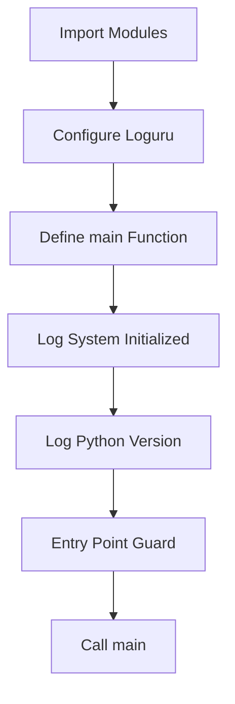

# Cobalt Agent - Main Entry Point Initialization Plan

## Overview
Initialize the [`cobalt_agent/main.py`](../cobalt_agent/main.py:1) file with proper logging configuration using loguru and a clean application startup structure.

## Context
- Project uses **loguru** for logging (already in dependencies)
- Python version: >= 3.11, < 3.14
- Logs directory exists at `/logs` for potential file logging
- Currently, [`main.py`](../cobalt_agent/main.py:1) is empty

## Implementation Steps

### 1. Import Required Modules
- Import `sys` for Python version access
- Import `logger` from `loguru`

### 2. Configure Loguru Logging
- Remove default loguru handler (it logs to stderr by default)
- Add a new handler with:
  - **Level**: INFO
  - **Format**: Include timestamp, level, and message
  - **Colorize**: Enable for better console readability
  - **Sink**: Console (stderr)

### 3. Optional: Add File Logging
- Consider adding file rotation to the `logs/` directory
- Format: `logs/cobalt_agent_{time}.log`
- Rotation: Daily or by size (e.g., 10 MB)
- Retention: Keep last 7 days

### 4. Create main() Function
The `main()` function should:
- Log: "Cobalt Agent - System Initialized"
- Log the Python version using `sys.version`
- Serve as the entry point for future application logic

### 5. Add Entry Point Guard
- Use `if __name__ == '__main__':` block
- Call `main()` function

## Code Structure



## Implementation Checklist

- [ ] Import `sys` and `logger` from loguru
- [ ] Remove default loguru handler
- [ ] Configure console logging with INFO level
- [ ] Add optional file logging to `logs/` directory
- [ ] Create `main()` function
- [ ] Log "Cobalt Agent - System Initialized" message
- [ ] Log Python version from `sys.version`
- [ ] Add `if __name__ == '__main__':` guard
- [ ] Call `main()` in the guard block
- [ ] Test the script runs without errors

## Expected Output
When running `python cobalt_agent/main.py`, you should see:
```
2026-02-07 12:00:00.000 | INFO     | __main__:main:15 - Cobalt Agent - System Initialized
2026-02-07 12:00:00.001 | INFO     | __main__:main:16 - Python Version: 3.11.x ...
```

## Future Considerations
- This entry point will eventually orchestrate:
  - Brain/Agent initialization
  - Interface setup (FastAPI)
  - Background task scheduling
  - Database connections
  - Redis connections
- Logging configuration can be extended with additional sinks
- Consider environment-based log levels (INFO for prod, DEBUG for dev)
